# AI Nights **BONUS** Content - Beginner Track

## Pre-requisites for your machine
* Clone this repository to your local machine to gain images and code samples you need for the demos: ```git clone https://github.com/amynic/ainights-sessionowners.git```
* [Microsoft Azure Subscription](https://azure.microsoft.com/en-gb/free/?WT.mc_id=ainights-github-amynic)
* Laptop with a modern web browser (Google Chrome, Microsoft Edge)
* [Postman, API Development Environment - available on Windows, Linux and macOS](https://www.getpostman.com/downloads/)
* **[BONUS SECTION]** [Download docker for your local machine - available on Windows, Linux and macOS](https://docs.docker.com/docker-for-windows/)

> *All demos and content have been tested on a Windows PC, however all options should run from macOS and Linux machines as well. Please provide information via an issue or pull request if you have feedback on other operating systems*  

## Go to sections:

* **Task A:** Microsoft Azure Cognitive Services - Computer Vision [Go to Section](#task-2-microsoft-azure-cognitive-services---custom-vision)
* **Task B:** Microsoft Azure Cognitive Services - Text Analytics in a Container [Go to Section](#task-3-build-custom-ai-into-an-application---azure-logic-apps)
* **Task C:** Microsoft PowerApps [Go to Section](#task-2-microsoft-azure-cognitive-services---custom-vision)

## Task A: Microsoft Azure Cognitive Services - Computer Vision

In this task you will try out the Cognitive Services using the website demo options

Navigate to: [https://azure.microsoft.com/en-gb/services/cognitive-services/directory/vision/](https://azure.microsoft.com/en-gb/services/cognitive-services/directory/vision/?WT.mc_id=ainights-github-amynic)


There are lots of different demos to try in each section (Scene and Activity Recognition in Images, OCR, Face Detection, Emotion Detection, Video indexer etc)

Select the **Demo** link next to **Scene and activity recognition in images** under **Computer Vision**. There are also other demo links to explore the different services


Now select **Browse** button and upload the **cat.jpeg** or **city.jpeg** image from ```sample-images/computer-vision-web-browser/cat.jpeg```


## Task 2: Microsoft Azure Cognitive Services - Text Analytics via REST

Now you will try using the REST protocol as you would use to integrate these services into an application

First log into [Microsoft Azure](https://azure.microsoft.com/en-gb/?WT.mc_id=ainights-github-amynic) and choose **Portal** in the top right corner.

Once in the portal select **Create a resource** and search **Cognitive Services** and choose Enter. Then select **Create** on the Cognitive Services blade


Enter details to create an account:
* **Name:** enter a suitable name for the service (example: ainightscognitive)
* **Subscription:** Choose your subscription
* **Location:** Choose your closest Data Center available
* **Pricing Tier:** S0
* **Resource Group:** Select 'Create new', and provide a sensible name (example ainights)
* **select the checkbox after reading the terms below**
* **select 'Create'**


Once created, in your notifications (top right corner) select **go to resource**


In the Cognitive Services page, select **Keys** and copy **KEY 1**


Now select **Overview** in the left hand pane and copy the **Endpoint** variable


Download and open Postman, an API Development environment on your local machine. 
> Find the download in the [Pre-requisites section](#Pre-requisites-for-your-machine)


Select **Request**


Enter request details as below and choose the option **create a new collection** and name it "Text Analytics Samples"


Select the newly created collection and choose save


Now create a request to call your text analytics API:
* Change from a GET request to a POST request in the top left
* Enter your endpoint URL and add ```text/analytics/v2.0/sentiment``` to the end
* Select Headers underneath the URL box
* In Key type ```Ocp-Apim-Subscription-Key``` and in Value add your KEY1 value
* In Key type ```Content-Type``` and in Value type ```application/json```
* 
* Select Body underneath the URL box
* Select ```raw``` from the radio button options
* Copy JSON sample from ```sample-code/cognitive-services-api-task/sentiment-analysis-text.json``` into the box
* Select the ```Send``` button and review the Response
* 

You can also try other options from the REST API - such as KeyPhrases function. Change the end of the URL from sentiment to keyPhrases and select send to view the key phrases for the example text.

* 

> Check out the language support for the Text Analytics API [here](https://docs.microsoft.com/en-gb/azure/cognitive-services/text-analytics/language-support/?WT.mc_id=ainights-github-amynic). If your language is supported please edit the JSON file to translate the text and show the functionality of the API above. There is an example of a French JSON file in ```sample-code/text-analytics-demo/sentiment-analysis-text-fr.json``` please edit this file as appropriate

> If you have any issues running Postman, API Development Environment you can always run the REST API requests within the API docs for [sentiment analysis](https://northeurope.dev.cognitive.microsoft.com/docs/services/TextAnalytics.V2.0/operations/56f30ceeeda5650db055a3c9/?WT.mc_id=ainights-github-amynic) and [key phrase extraction](https://northeurope.dev.cognitive.microsoft.com/docs/services/TextAnalytics.V2.0/operations/56f30ceeeda5650db055a3c6/?WT.mc_id=ainights-github-amynic). Select the data centre you are using and then enter your key in the box provided along with the sample body sample used in Postman

## Task: Microsoft Azure Cognitive Services - Text Analytics in a Container

Demo based on the Azure Documentation: [Install and run Text Analytics containers](https://docs.microsoft.com/en-us/azure/cognitive-services/text-analytics/how-tos/text-analytics-how-to-install-containers/?WT.mc_id=ainights-github-amynic)

In order to run this demo you will need Docker installed locally on your machine
[Download docker for your local machine here - available on Windows, Linux and macOS](https://docs.docker.com/docker-for-windows/)

Once the download starts you can see the information of its progress


Once installed, run Docker (on windows type docker into the start menu and select Docker Desktop)
Check the Docker Daemon is running on your machine.

In windows you can find the icon in the bottom left toolbar near the date/time

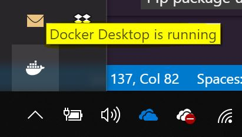

In order to run the Cognitive Services Text Analytics API locally you need to get the image for your machine. Open a command prompt within a folder on your machine (I recommend creating an AI-Nights folder if you haven't done already)

Enter the command below

```docker pull mcr.microsoft.com/azure-cognitive-services/sentiment:latest```

and the docker image should start to download to your local registry


> If you see an error similar to the below, double check your Docker Daemon is running before executing docker commands. To confirm it is running try the [Getting Started Guide from Docker Here](https://docs.docker.com/docker-for-windows/) 

Now its downloaded we want to start running the container so we can query it with text sentences and gain our sentiment scores back.

In order to run the container you will need you **Cognitive Services Endpoint** and your **API Key** from the previous section

>if you wish to prove the container is local. Disconnect from the internet now

The docker run command looks like below ([or is available here](sample-code/cognitive-containers/run-container-command.txt)). Substitute the data center and API key values and run

```docker run --rm -it -p 5000:5000 --memory 4g --cpus 1 mcr.microsoft.com/azure-cognitive-services/sentiment Eula=accept Billing=https://<datacenter-here>.api.cognitive.microsoft.com/text/analytics/v2.0 ApiKey=<key>```

The container is running on your local machine
To understand how to query the local API review the Swagger definition here: [http://localhost:5000/swagger/index.html](http://localhost:5000/swagger/index.html)


To test the API, make a new postman request:
* POST
* URL: http://localhost:5000/text/analytics/v2.0/sentiment
* Headers:
    * Content-Type : application/json
    * 

* Body:
    * enter the sample JSON input from the [previous exercise](sample-code/text-analytics-demo/sentiment-analysis-text.json)
    * 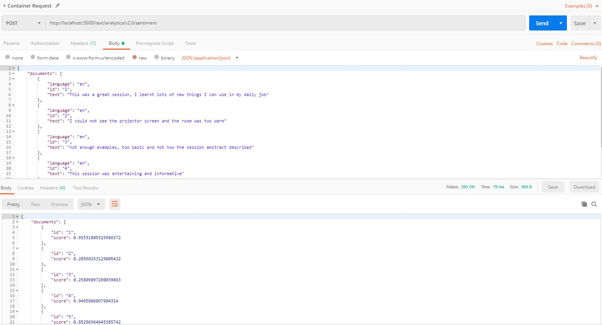


To stop the container from running when you finish, go back ot the command line and type **CTRL + C** this will show the application shutting down


# Task: Microsoft Power Apps
## Creating a front end application to take a picture of a dog and analyse it

> NOTE: you must use your organizational account to use PowerApps. As this may become an issue 

Navigate to: [https://powerapps.microsoft.com/en-us/?WT.mc_id=build2019-event-amynic](https://powerapps.microsoft.com/en-us/) and sign in with your organizational account.

This will take you to the PowerApps main menu screen. Select the **Canvas App from Blank** button


Provide an App Name, **example: Dog Spotter** and in this case select **Format:Phone**

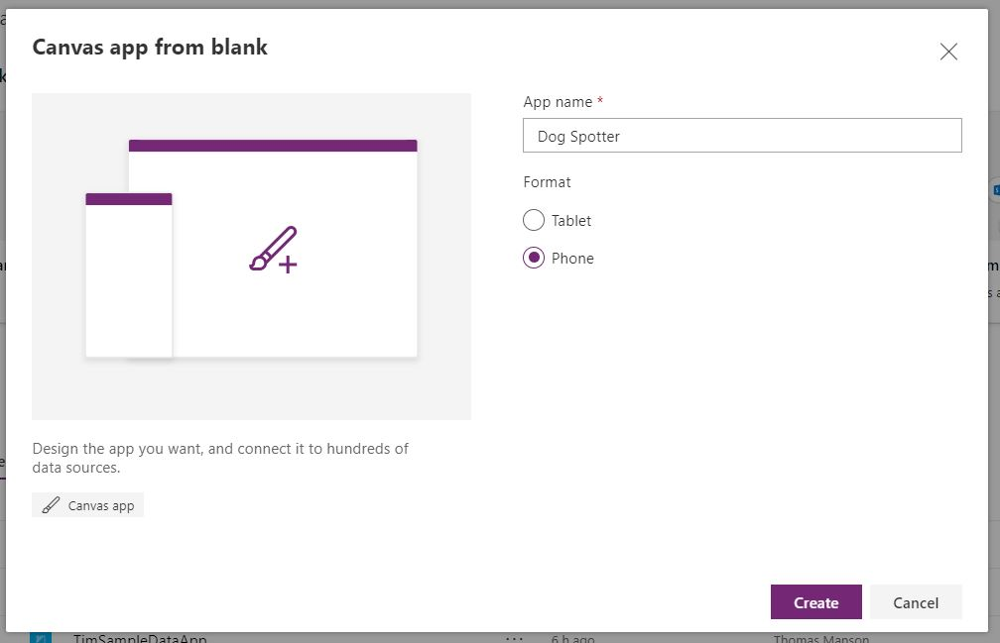

This will load a screen like shown below. With a user interface for you to start building your application using the click-and-drag interface.

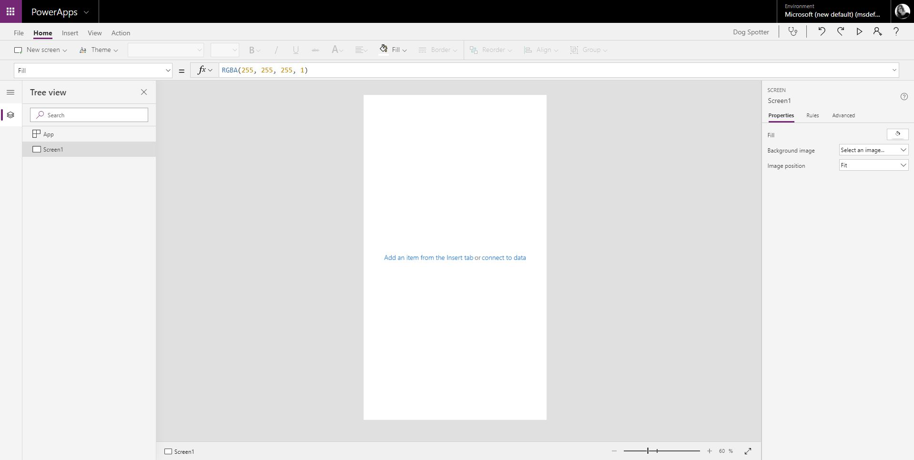

To start building our app we are going to need to insert some functionality. You will find the **insert** menu at the top of the page like below


First we are going to insert **Camera** functionality. Under the insert tab select the **Media** dropdown and select the **Camera** option


Position the camera in good place on the page and you will see a properties pane appear on the right side of the page

Choose the **Advanced** tab from the properties pane. Under **Action** and **OnSelect** insert

``` Collect(myPics, Camera1.Photo) ```


Next we are going to insert a title for the application. Go to the **insert** tab and select the **Text** dropdown menu. Under this menu select **Label**


Place the Title at the top of the page. Under the properties pane on the right update the options below:
* **Text:** Dog Spotter (or another application name you would like)
* **Font Size:** 60
* **Text Alignment:** Center

> Making other changes on the properties pane will change the look and information within your app. Please investigate the options available to you. In this tutorial we will only look at a few

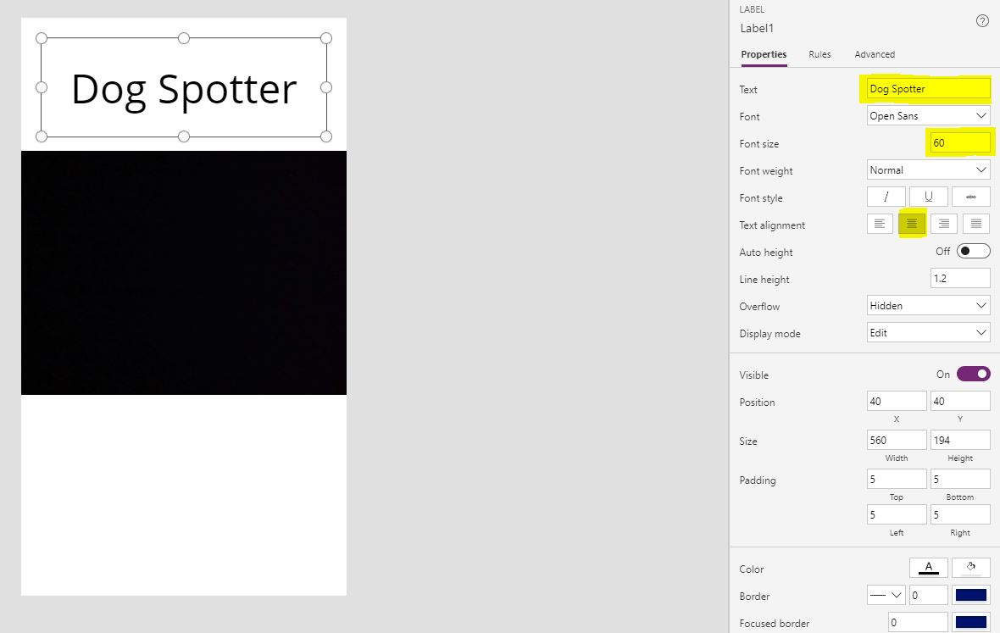

Now we are going to insert a **Photo Gallery**. When a photo is taken it will appear in the app at the bottom of the page.

Go to the **Insert** tab and select **Gallery**. Choose the **Horizontal** option and position the item on the page below the camera


In order for the application to know which pictures to use we reuse the **myPics** variable we created in the Camera setup

On the properties pane, select **myPics** from the **Items** dropdown menu

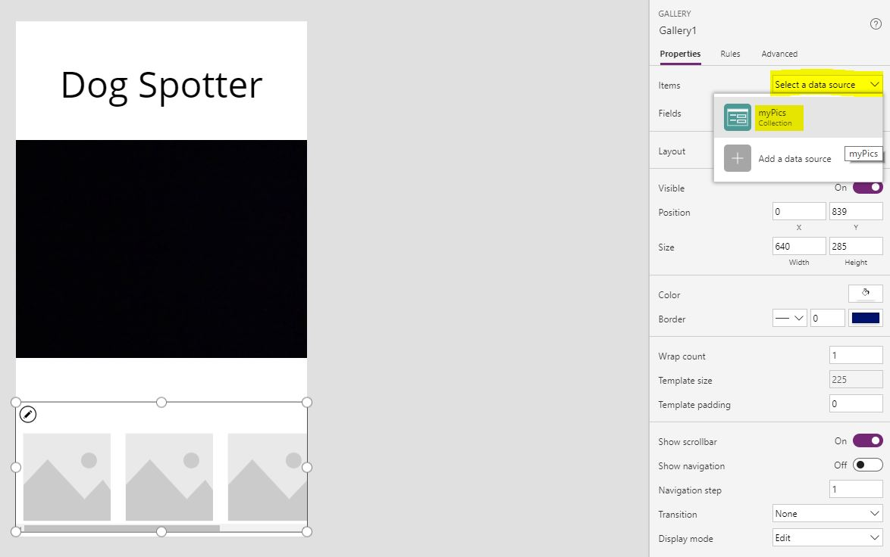

Now select a single image slot from the gallery and on the properties pane select the **Advanced** tab. Complete the code below for the correct fields:

* OnSelect: ``` Remove(myPics, ThisItem) ```
* Image: ``` ThisItem.Url ```

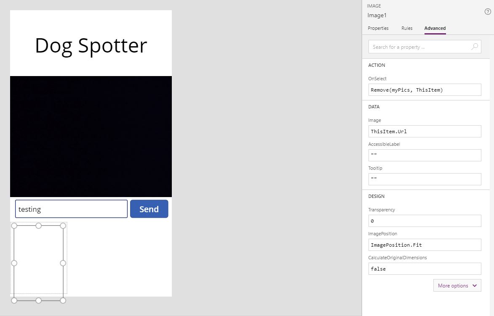

Next we add a **Text Input** box from the **Text** menu on the insert tab. This box will allow us to give our image a name when we send it to Azure Blob Storage.


Align the **Text Input** box underneath the Camera and above the Image gallery

Finally add a **Button** to the page. This cna be found underneath the **Insert -> Controls -> Button** options

Place the button next to the text input box underneath the Camera

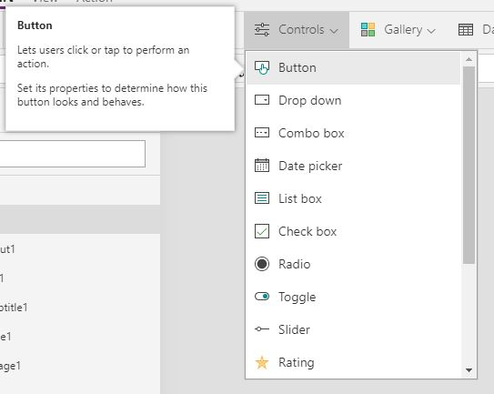

On the properties pane for the button change the **Text** field to **Send**


Now we need to add Azure Blob Storage as our data source. This will mean we can send the image taken by the camera in the app to storage and this will trigger our Logic app

Go to **View** in the main toolbar, then **Data Sources**. This will open a pane on the right where you can click **Add Data Source**


Select **New Connection** and search for **blob** in the search box. Then click the Azure Blob Storage option


Insert the connection information for your Azure Blob Storage account you used in the Logic App scenario: example ainightsstor.

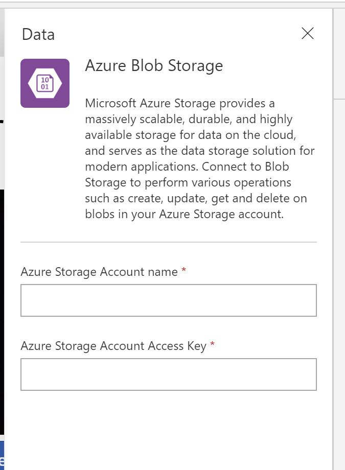

Once authenticated you will then see your blob storage connection added to the connections pane


Now we can use this connection in a function. Click on the **Send** button and switch to the **Advanced** pane.

In the OnSelect box type: 
 ``` AzureBlobStorage.CreateFile("images", TextInput1.Text, Camera1.Photo) ```


Now we have built an app lets test it in our development environment. In the top right of the screen you will see the toolbar below - press the **Play** button highlighted. This will open a new window with your application running. This will ask for access to your camera to test the app


> Test you app by taking a picture of a dog (or anything at this point). The camera will take a picture - name it - click the send button. Once sent wait a moment and you should recieve an email as your Logic app will have triggered


Now we are going to **Save** and **Publish** the application so you can use it on your mobile device

Go to the **File** tab in to top toolbar and choose the option on the left pane **Save**. Then click the **save** button.

Once saved you will have the **Publish** button appear - select this


You can also edit the look of the icon for the application. In the **File** menu go to **App Settings**.

In **App Name and Icon** select a background color for your application and choose an icon. You can also upload you own. Why not add a dog icon? Download the icon from [here](sample-code/dog-icon.png) and choose the **browse** button to add your own icon

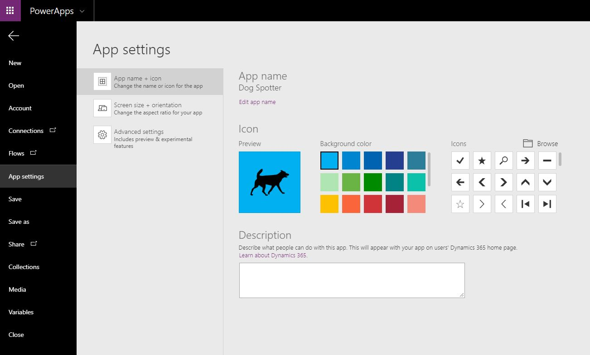

In order to view your published app on your phone you will need to download the PowerApps app from your app store. 

> For this tutorial the instructions will be for IOS.


Once the app is download. Open the application and log in with your organizational credentials. Once logged in you should see all your organizations apps listed


For you Dog Spotter app we want to add it to your home screen like any other application. Click on the 3 dots (...) and select **pin to home**


This will open the web browser where you follow the instructions to add it to your home screen. Select the share button.

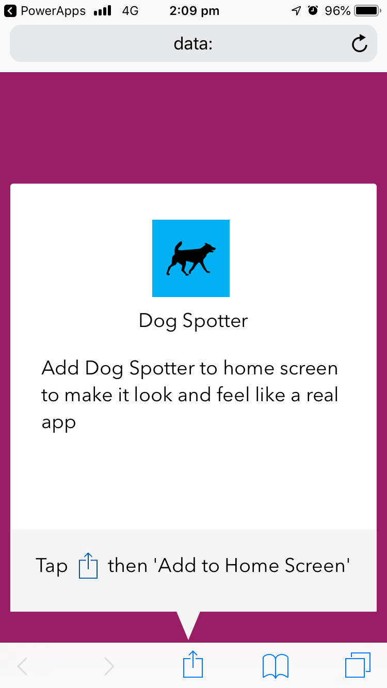

Select **Add to Home Screen**

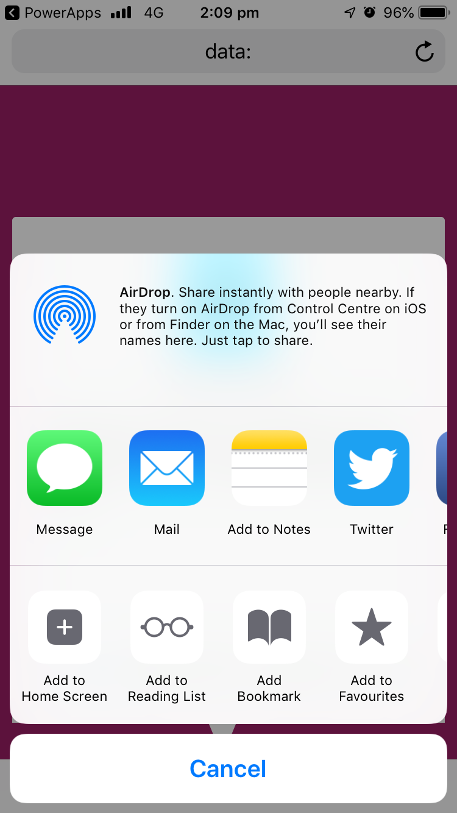

Provide your application useful name to be shown on your phone and select Add

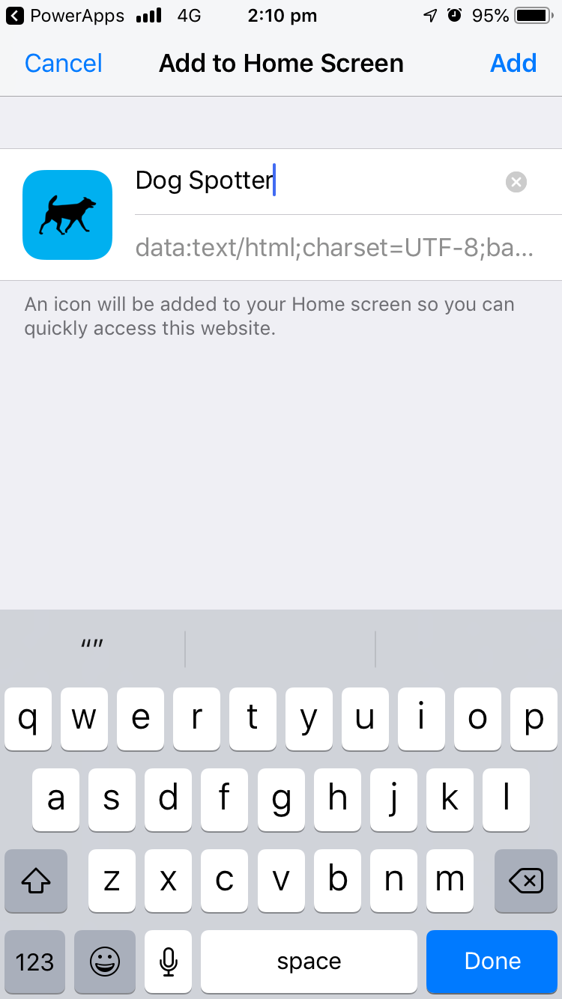

## Congratulations!! 

The app is now added to your phone home screen and you can open and run the functionality.

Test the app by taking a picture of a dog and sending it to the cloud.